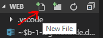
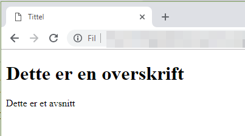
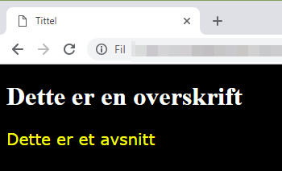
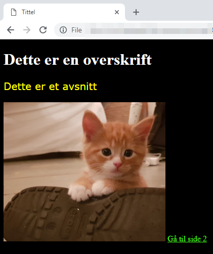

# Programmering av en nettside med HTML, CSS og JavaScript

## Forberedelse

Vi skal bruke [Visual Studio Code](https://code.visualstudio.com/) som program for å skrive og redigere nettside-koden, og nettleseren Chrome for å vise resultatet, så sjekk at du har disse programmene installert på din PC.


## Oppgave

Lag en nettside om et tema f.eks. noe du interesserer deg for. Eksempel kan være: langrenn, ridning, friluftsliv, dataspill etc. Hovedpoenget er å få det til å fungere og at du får brukt de HTML taggene vi lærer, så ikke viktig med mye tekst i første omgang. Nettsiden skal bestå av minst to ulike sider (f.eks. `index.html` og `side2.html`), og det skal være linker som gjør at du kan navigere fra den ene siden til den andre og tilbake igjen.

Utseende på siden skal styres av en CSS fil, bruk den til å endre farge på:
- Bakgrunn
- Overskrifter
- Tekst

## Del A - Lag den første HTML koden

Lag en mappe for din webside på ditt hjemmeområde under året og faget. Alle filene du lager til nettsiden skal ligge i denne mappen.

1. Åpne mappen du har laget i Visual Studio Code med `Open Folder...`
2. Lag en ny fil i mappen med `New File` knappen (du finner den til venstre med å holde muspekeren over navnet på mappen din) Gi filen navnet `index.html`.



Skriv inn følgende i `index.html` filen:

```html
<!DOCTYPE html>  
<html>  
<head>  
<title>Tittel</title>  
</head>  
<body>  
	  
<h1>Dette er en overskrift</h1>  
<p>Dette er et avsnitt.</p>  
	  
</body>  
</html>  
```

Lagre filen og prøv så å åpne den i Chrome. Det vi ser nå er standard-stilen i Chrome, som er hvit bakgrunn og svart tekst, samt at vi ser tittelen er skrevet i ark-fanen:



## Del B - Bruk CSS for å styre utseende på nettsiden

Lag en ny fil, kall den for `style.css`. Skriv inn følgende i CSS filen:

```css
body {  
    background-color: black;  
}  
	  
h1 {  
    color: white;  
}  
    
p {  
    font-family: verdana;  
    font-size: 20px;  
    color: yellow;
}
```

Vi må i tilleg endre i HTML filen slik at den tar i bruk den nye CSS filen. Legg til følgende linje i HTML filen, under linjen med `<title>`:

```HTML
<link rel="stylesheet" type="text/css" href="style.css">
```

Åpne `index.html` igjen i Chrome (har du den åpen fra før, kan du bruke `F5` for å laste den inn på nytt). Nå ser vi at farge og utseende er endret:



### Tips - CSS og farger

Farger i CSS kan enten legges inn som tekst slik vi har gjort her, eller at man angir det med tall fra 0 til 255 for hver av fargekanalene rød, grønn og blå. Listen over fargenavn som kan brukes finner du her: [https://www.w3schools.com/colors/colors_names.asp](https://www.w3schools.com/colors/colors_names.asp)

Eksempel:
```css
color: white;
```

For å lage dine egne farger med å kombinere fargekanalene, så finner du mer informasjon her: [https://www.w3schools.com/colors/](https://www.w3schools.com/colors/)

Eksempel 1 - hvit farge (full lys-styrke på alle fargekanalene):
```css
color: rgb(255, 255, 255);
```

Eksempel 2 - rød farge (full lys-styrke på rød-kanalen, ingen på de to andre):
```css
color: rgb(255, 0, 0);
```

## Del C - Linker

For å linke til en annen nettside, så brukes taggen `<a>`. 

Eksempel:

```html
<a href="http://www.w3schools.com">Dette er en link</a>
```

Som vi ser her så startes taggen med `<a`, deretter bruker vi et *parameter/attributt* til å angi hvor linken skal føre hen, deretter avsluttes beskrivelsen av `<a>` taggen, - men selve taggen er ikke avsluttet før vi kommer til `</a>`. Det som da står mellom `<a>` og `</a>` er det som vil vises i nettleseren, - det som brukeren klikker på for å komme dit `href` angir.

Vi kan bruke dette til å lage en ny side, som vi kan gå til fra `index.html`. Lag en ny fil og kall den for `side2.html`. I `index.html` legger vi til nesten nederst (men før `</body>`):

```html
<a href="side2.html">Gå til side 2</a>
```

I `side2.html` kan du skrive inn:

```html
<!DOCTYPE html>  
<html>  
<head>  
<title>Side 2</title>  
<link rel="stylesheet" type="text/css" href="style.css">
</head>  
<body>  
	  
<h1>Velkomment til side 2</h1>  
<p>Hei, dette er side 2</p>  

<a href="index.html">Tilbake til forsiden</a>
</body>  
</html>  
```

Lagre begge filene, og åpne `index.html` igjen. Nå kan du gå til side to med å klikke på linken, og tilbake igjen.

### Tips
Lær mer om `<a>` taggen her: [http://www.w3schools.com/html/html_basic.asp](http://www.w3schools.com/html/html_basic.asp)

## Del D - Bilder

Bilder settes inn med `` taggen. Eksempel:

```html

```

Her ser vi `<img` som start på taggen, og så `src` som attributt (forkortelse av det engelske ordet *source* som betyr kilde), og navnet på bildet vi vil bruke. Hvis bildet ligger i samme mappe som HTML filen, så kan man bare legge inn filnavnet her. Ligger filen et annet sted må det være med, f.eks hvis det ligger i en mappe som heter `bilder` så vil det bli `src="bilder/simba.jpg"`.

Legger vi dette til på `index.html` så kan det se slik ut:


